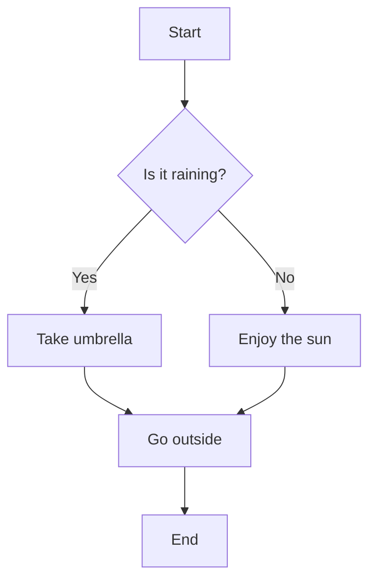
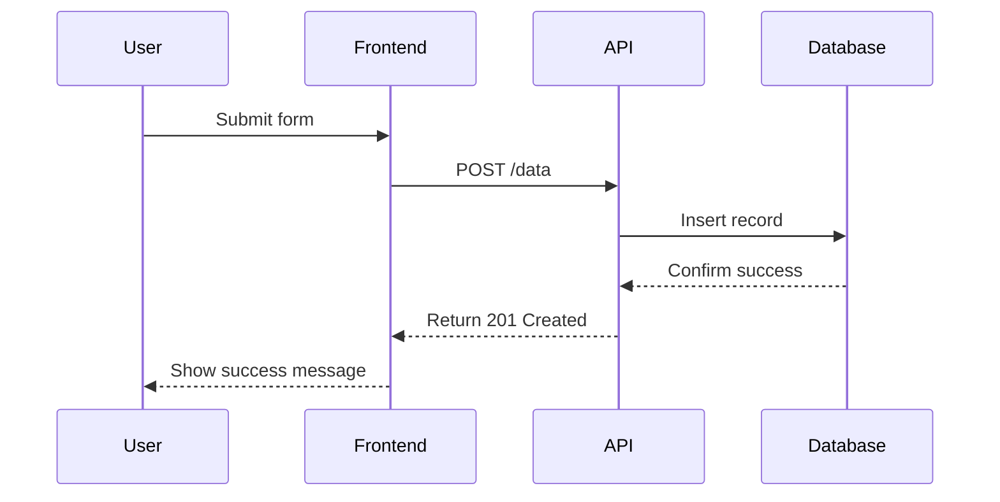
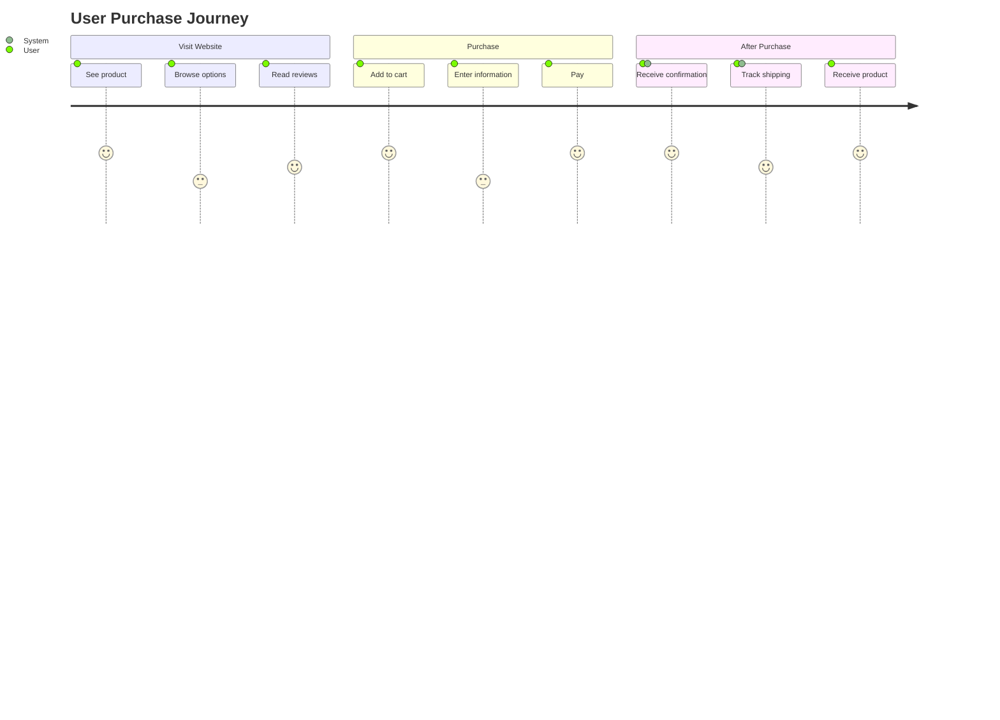

# mermaid-test

Flowchart:


Sequence:


User purchase journey:


Git graph:
```
gitGraph
    commit
    commit
    branch develop
    checkout develop
    commit
    commit
    checkout main
    merge develop
    commit
    branch feature
    checkout feature
    commit
    commit
    checkout develop
    merge feature
    checkout main
    merge develop
    commit
```
